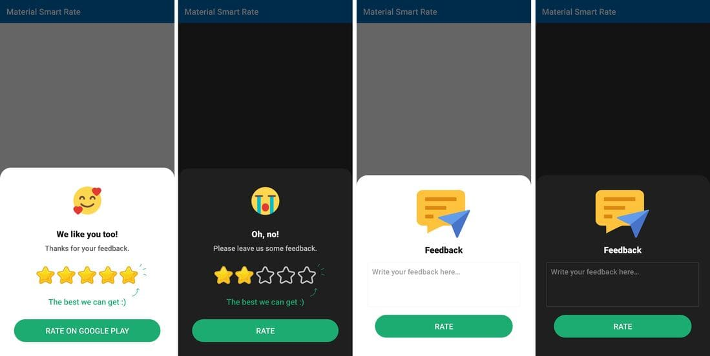

# Material Smart Rating App
[](https://jitpack.io/#vimalcvs/Material-Smart-Rating)

Material Smart app rate dialogue for Android, which considers user rating. The conference will give feedback if the user rates the app below the defined threshold rating. Otherwise, It will take the user to the
Google PlayStore.



## Features
- Auto fetches the app icon to appear on top of the dialogue
- Make the dialogue appear on a defined app session
- Opens Feedback form if the user rates below the minimum threshold
- Extracts the accent colour from your app's theme
- Customizable title, positive button and negative button texts
- Customizable button colours and backgrounds
- Override dialogue redirection to Google Play or Feedback form according to your needs

If you want the dialogue builder method, move the code to your Activity class's `setOnClickListener()` way.

## Installation

Add jetpack in your root build. Gradle at the end of repositories:
```
	allprojects {
		repositories {
		
			...
			maven { url 'https://jitpack.io' }
		}
```
Step 2. Add the dependency

```
	dependencies {
	
	         ...
	         implementation 'com.github.vimalcvs:Material-Smart-Rating:3.0.0'
	 
	}
```

## How to use
Use the Rating as it is `setOnClickListener()` Just like <a href="https://github.com/vimalcvs/Material-Smart-Rating/blob/master/app/src/main/java/com/vimalcvs/myrateapp/MainActivity.java">MainActivity.java</a>
```java
        Button button = findViewById(R.id.rate_ok);
        button.setOnClickListener(v -> {
	
	    //Rating
            MaterialRatingApp materialRatingApp = new MaterialRatingApp (this);
            materialRatingApp.showNow(getSupportFragmentManager(), "");
        });
```

Use the Feedback as it is `setOnClickListener()` Just like <a href="https://github.com/vimalcvs/Material-Smart-Rating/blob/master/app/src/main/java/com/vimalcvs/myrateapp/MainActivity.java">MainActivity.java</a>
```java
        Button feedback = findViewById(R.id.feedback_ok);
        feedback.setOnClickListener(v -> {
	
	   //Feedback
            MaterialFeedbackApp bottomSheetDialog = new MaterialFeedbackApp ("youremailid@gmail.com");
            bottomSheetDialog.showNow(getSupportFragmentManager(), "");
        });
```

## Credits

This project was initiated by **TechnoVimal.in**. You can contribute to this project by submitting issues or/and forking this repo and sending a pull request.


Follow us on:

[](https://www.facebook.com/vimalcvs)&nbsp;&nbsp;&nbsp;&nbsp;&nbsp;[](https://twitter.com/vimalvishwakar6)

Author: [Vimal K. Vishwakarma](https://github.com/vimalcvs)

# License
```
Copyright (C) 2020 Code Mr Vimal K. Vishwakarma
Licensed under the Apache License, Version 2.0 (the "License");
you may not use this file except in compliance with the License.
You may obtain a copy of the License at
http://www.apache.org/licenses/LICENSE-2.0
Unless required by applicable law or agreed to in writing, software
distributed under the License is distributed on an "AS IS" BASIS,
WITHOUT WARRANTIES OR CONDITIONS OF ANY KIND, either express or implied.
See the License for the specific language governing permissions and
limitations under the License.
```
