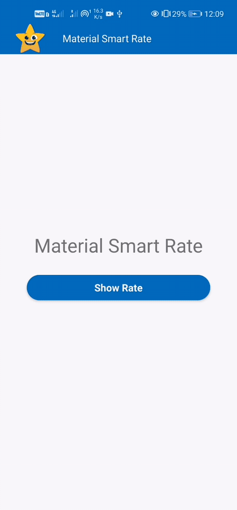

# Material Smart Rating App
[](https://jitpack.io/#vimalcvs/Material-Smart-Rating)

Material Smart app rate dialog for Android which takes user rating into consideration. If the user rates the app below the defined threshold rating, the dialog will change into a feedback form. Otherwise, It will take the user to the
Google PlayStore.



## Features
- Auto fetches the app icon to appear on top of the dialog
- Make the dialog appear on a defined app session
- Opens Feedback form if the user rates below the minimum threshold
- Extracts the accent color from your app's theme
- Customizable title, positive button and negative button texts
- Customizable button colors and backgrounds
- Override dialog redirection to Google Play or Feedback form according to your needs

If you want the dialog builder method and move the code to the `setOnClickListener()` method of your Activity class.
 
## Installation

Add jitpack in your root build.gradle at the end of repositories:
```
	allprojects {
		repositories {
			...
			maven { url 'https://jitpack.io' }
		}
```
Step 2. Add the dependency

```
	dependencies {

	         implementation 'com.github.vimalcvs:Material-Smart-Rating:1.0.6'

	}
```

## How to use
Use the dialog as it is `setOnClickListener()` Just like <a href="https://github.com/vimalcvs/Material-Smart-Rating/blob/master/app/src/main/java/com/vimalcvs/myrateapp/MainActivity.java">MainActivity.java</a>
```java
        LinearLayout linearLayout = findViewById(R.id.rate_ok);
        linearLayout.setOnClickListener(new View.OnClickListener() {
            @Override
            public void onClick(View v) {
	    
                ///Rate Dialog
                RateDialogManager.showRateDialog(MainActivity.this, savedInstanceState);

            }
        });
```
## Add Icon 
Add email **drawable/ic_rate_feedback.png** to your **drawable** file. Auto fetches the app icon to appear on top of the dialog.
```xml
    ...drawable/ic_rate_feedback.png
    ...drawable/ic_rate_star.png
```
## Add Email
Add email **res/values/** to your **strings.xml** file. Auto fetch the app email id.
```xml
....
<resources>
    <string name="email">technovimalin@gmail.com</string>
....
```
## Add Button Color
Add email **res/values/** to your **color.xml** file. Auto fetch the Button Color.
```xml
....
   <resources>
    <color name="rate_icon_color">#0d7eff</color>
    <color name="rate_button_color">#006cbc</color>
	  
    <color name="rate_active_color">#edbd31</color>
    <color name="rate_normal_color">#959595</color>
....
```

## Credits

This project was initiated by **TechnoVimal.in**. You can contribute to this project by submitting issues or/and by forking this repo and sending a pull request.


Follow us on:

[](https://www.facebook.com/vimalcvs)&nbsp;&nbsp;&nbsp;&nbsp;&nbsp;[](https://twitter.com/vimalvishwakar6)

Author: [Vimal K. Vishwakarma](https://github.com/vimalcvs)

# License
```
Copyright (C) 2020 Code Mr. Vimal K. Vishwakarma

Licensed under the Apache License, Version 2.0 (the "License");
you may not use this file except in compliance with the License.
You may obtain a copy of the License at

http://www.apache.org/licenses/LICENSE-2.0

Unless required by applicable law or agreed to in writing, software
distributed under the License is distributed on an "AS IS" BASIS,
WITHOUT WARRANTIES OR CONDITIONS OF ANY KIND, either express or implied.
See the License for the specific language governing permissions and
limitations under the License.
```
